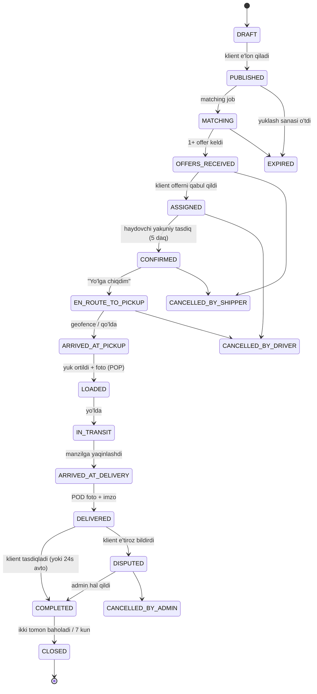

# 03 — User Flow va Order Lifecycle

## 3.1. Onboarding flow — Yuk beruvchi

```
Splash
  └─ Til tanlash (UZ / RU / EN)          [faqat birinchi ochilishda]
      └─ Onboarding 3 slayd  ──skip──┐
          └─ Telefon kiritish (+998 __ ___ __ __)
              └─ SMS OTP (6 raqam, 60s taymer, 3 urinish)
                  ├─ Yangi user → Rol tanlash: [Yuk beruvchi] [Haydovchi]
                  │      └─ Ism/Familiya → (ixtiyoriy) Avatar → (ixtiyoriy) Kompaniya
                  │          └─ HOME (Yuk beruvchi)
                  └─ Mavjud user → HOME (oxirgi rol bo'yicha)
```

**Muhim qaror:** Yuk beruvchi uchun hujjat verifikatsiyasi **majburiy emas** — bu
ro'yxatdan o'tish konversiyasini pasaytiradi. Verifikatsiya faqat escrow yoki
korporativ tarif yoqilganda talab qilinadi.

## 3.2. Onboarding flow — Haydovchi

```
Telefon + OTP
  └─ Rol: Haydovchi
      └─ 1-qadam: Shaxsiy (ism, familiya, tug'ilgan sana, avatar)
          └─ 2-qadam: Hujjat (pasport/ID old+orqa, guvohnoma old+orqa)
              └─ 3-qadam: Transport (marka, model, yil, davlat raqami)
                  └─ 4-qadam: Texnik (tur, kuzov, quvvat t, hajm m³, o'lchamlar, tirkama)
                      └─ 5-qadam: Transport foto (3+) va texpasport
                          └─ 6-qadam: Ishlash yo'nalishlari (viloyatlar / radius)
                              └─ "Tekshiruvda" ekrani  ⏳
                                     ├─ Yuklarni KO'RA OLADI (read-only)
                                     └─ Offer YUBORA OLMAYDI
                                          └─ Admin tasdiqlagach → to'liq huquq ✅
```

**Muhim qaror:** haydovchi tasdiqlanmagan bo'lsa ham lentani ko'radi — bu uni
platformada ushlab turadi (retention), lekin bitim qila olmaydi (ishonch).

SLA: verifikatsiya **≤ 2 ish soati** ichida (ish vaqtida). Bu KPI sifatida o'lchanadi.

## 3.3. Yuk yaratish flow (Create Load)

```
HOME → [+ Yuk joylashtirish]
 │
 ├─ QADAM 1/4 — MARSHRUT
 │    • Qayerdan: qidiruv / xaritadan pin / "Saqlangan manzillarim"
 │    • Qayerga: shu tarzda
 │    • (avtomatik) Masofa: 308 km · Taxminiy yo'l vaqti: 4 s 20 daq   ← OSRM
 │
 ├─ QADAM 2/4 — YUK
 │    • Kategoriya (chip'lar: Oziq-ovqat, Qurilish, Mebel, Texnika, ...)
 │    • Nomi, og'irligi (kg/t), hajmi (m³), o'ram soni va turi
 │    • Foto (5 tagacha), tavsif
 │
 ├─ QADAM 3/4 — TRANSPORT VA VAQT
 │    • Transport turi (Damas … Fura) — ko'p tanlov mumkin
 │    • Kuzov turi (Tent / Ref / Izoterm / Ochiq / Furgon)
 │    • Yuklash sanasi + vaqt oynasi
 │    • Maxsus talablar (chip: Gruzchik, Gidrobort, +2..+8 °C, Ramp)
 │
 ├─ QADAM 4/4 — NARX
 │    • Tavsiya: "Bu yo'nalishda o'rtacha 1 850 000 so'm"     ← V2
 │    • Narx (UZS) yoki [Kelishuv asosida]
 │    • To'lov turi: Naqd / Karta / O'tkazma
 │    • Komissiya ko'rsatiladi (shaffoflik)
 │
 └─ KO'RIB CHIQISH → [E'LON QILISH]
        └─ Backend: load.status = PUBLISHED
             └─ Matching job (BullMQ) ishga tushadi  (~2-5 s)
                  └─ Top-20 haydovchiga push
                       └─ "Haydovchilar qidirilmoqda…" ekrani (live counter)
```

## 3.4. Offer flow (ikki tomonlama bozor)

Ikki yo'nalishda ham ishlaydi:

**A. Haydovchi → Klient (asosiy oqim)**
1. Haydovchi push oladi: "Sizga mos yuk: Toshkent → Samarqand, 12 t, 1.8 mln"
2. Yuk kartasini ochadi → Match Score 93% ko'radi
3. `[So'rov yuborish]` — o'z narxini taklif qilishi mumkin (counter-offer)
4. Klientga push: "Yangi taklif: Alisher K. · ⭐4.8 · 1 750 000 so'm"

**B. Klient → Haydovchi**
1. Klient "Mos haydovchilar" ro'yxatidan haydovchi tanlaydi
2. `[Taklif yuborish]` → haydovchiga push
3. Haydovchi qabul qiladi / rad etadi

Offer qoidalari:
- Offer amal qilish muddati: **30 daqiqa** (keyin `EXPIRED`)
- Bitta yukka bitta haydovchi faqat **1 ta faol offer** yubora oladi
- Klient offer qabul qilganda qolgan barcha offerlar avtomatik `REJECTED`
- Counter-offer chegarasi: e'lon narxining ±30% (spam va demping oldini olish)

## 3.5. Order Lifecycle — State Machine



### Statuslar jadvali

| # | Status | Kim o'zgartiradi | Mobil UI matni | Yon ta'sir |
|---|---|---|---|---|
| 1 | `DRAFT` | Klient | Qoralama | — |
| 2 | `PUBLISHED` | Klient | E'lon qilindi | matching job navbatga |
| 3 | `MATCHING` | Tizim | Haydovchi qidirilmoqda | top-20 ga push |
| 4 | `OFFERS_RECEIVED` | Tizim | N ta taklif bor | klientga push |
| 5 | `ASSIGNED` | Klient | Haydovchi tanlandi | boshqa offerlar rad, 5 daq taymer, **CHAT OCHILADI** |
| 6 | `CONFIRMED` | Haydovchi | Buyurtma tasdiqlandi | GPS kuzatuv yoqiladi (chat 5-bosqichda ochilgan) |
| 7 | `EN_ROUTE_TO_PICKUP` | Haydovchi | Yo'lga chiqdi | tracking boshlanadi (10 s interval) |
| 8 | `ARRIVED_AT_PICKUP` | Haydovchi/geofence | Yuk olish nuqtasida | klientga push, **TELEFON RAQAMLARI OCHILADI** |
| 9 | `LOADED` | Haydovchi | Yukni oldi | POP foto majburiy |
| 10 | `IN_TRANSIT` | Haydovchi | Yo'lda | ETA hisoblanadi |
| 11 | `ARRIVED_AT_DELIVERY` | Haydovchi/geofence | Manzilga yaqinlashdi | klientga push |
| 12 | `DELIVERED` | Haydovchi | Yetkazib berildi | POD foto + imzo, GPS **o'chadi** |
| 13 | `COMPLETED` | Klient / 24s avto | Tasdiqlandi | escrow release, komissiya yechiladi |
| 14 | `CLOSED` | Tizim | Yopildi | reyting ochiladi |
| — | `CANCELLED_BY_*` | Klient/Haydovchi/Admin | Bekor qilindi | jarima siyosati |
| — | `EXPIRED` | Tizim | Muddati o'tdi | — |
| — | `DISPUTED` | Klient | Nizo | admin navbatiga |

### Transition qoidalari (backend'da majburlanadi)

```ts
const ALLOWED: Record<OrderStatus, OrderStatus[]> = {
  DRAFT:                 ['PUBLISHED', 'CANCELLED_BY_SHIPPER'],
  PUBLISHED:             ['MATCHING', 'CANCELLED_BY_SHIPPER', 'EXPIRED'],
  MATCHING:              ['OFFERS_RECEIVED', 'EXPIRED', 'CANCELLED_BY_SHIPPER'],
  OFFERS_RECEIVED:       ['ASSIGNED', 'EXPIRED', 'CANCELLED_BY_SHIPPER'],
  ASSIGNED:              ['CONFIRMED', 'CANCELLED_BY_DRIVER', 'CANCELLED_BY_SHIPPER'],
  CONFIRMED:             ['EN_ROUTE_TO_PICKUP', 'CANCELLED_BY_DRIVER', 'CANCELLED_BY_SHIPPER'],
  EN_ROUTE_TO_PICKUP:    ['ARRIVED_AT_PICKUP', 'CANCELLED_BY_DRIVER'],
  ARRIVED_AT_PICKUP:     ['LOADED', 'CANCELLED_BY_DRIVER'],
  LOADED:                ['IN_TRANSIT'],
  IN_TRANSIT:            ['ARRIVED_AT_DELIVERY'],
  ARRIVED_AT_DELIVERY:   ['DELIVERED'],
  DELIVERED:             ['COMPLETED', 'DISPUTED'],
  COMPLETED:             ['CLOSED'],
  DISPUTED:              ['COMPLETED', 'CANCELLED_BY_ADMIN'],
  CLOSED: [], EXPIRED: [],
  CANCELLED_BY_SHIPPER: [], CANCELLED_BY_DRIVER: [], CANCELLED_BY_ADMIN: [],
};
```

Har bir o'tish `order_status_history` ga yoziladi: `from`, `to`, `actor_id`,
`actor_role`, `lat/lng`, `note`, `created_at`. Bu **nizoni hal qilishning asosiy dalili**.

## 3.6. Bekor qilish va jarima siyosati

| Qachon | Kim | Oqibat |
|---|---|---|
| `CONFIRMED` gacha | Har kim | Jarimasiz |
| `CONFIRMED` → `EN_ROUTE` (2 soatdan ko'p qolgan) | Haydovchi | Ogohlantirish; 30 kunda 3 marta → reyting jarimasi |
| `EN_ROUTE` dan keyin | Haydovchi | Jarima = narxning 10% (hamyondan), reyting −0.2 |
| `CONFIRMED` dan keyin | Klient | Jarima = narxning 10% yoki min 30 000 so'm |
| `LOADED` dan keyin | Har kim | Faqat admin orqali (nizo rejimi) |

## 3.7. Bo'sh qaytish (Backhaul) flow — V2

```
Buyurtma DELIVERED bo'ldi (Samarqand)
  └─ Tizim haydovchining "uy bazasi" ni biladi (Toshkent)
      └─ Job: Samarqand atrofi 50 km dan Toshkent yo'nalishidagi PUBLISHED yuklarni izlaydi
          └─ Topilsa: push "🔁 Qaytishga yuk bor: Samarqand → Toshkent, 900 000 so'm"
              └─ Haydovchi 1 tegish bilan offer yuboradi
```

Bu **eng katta biznes qiymati**: bo'sh yurish 35–45% dan 20% gacha tushsa,
haydovchining daromadi ~25% oshadi — bu platformadan ketmaslikning asosiy sababi.

## 3.8. To'lov flow (MVP — naqd + hamyon komissiyasi)

```
Buyurtma COMPLETED
  └─ commission = order_price × commission_rate   (masalan 5%)
      ├─ Haydovchi hamyonida yetarli mablag' bor
      │     └─ ledger: DEBIT driver_wallet / CREDIT platform_revenue
      └─ Yetarli emas
            └─ hamyon manfiy balansga tushadi (limit −200 000 so'm)
                 └─ limitdan oshsa: yangi offer yuborish BLOKLANADI
                      └─ push: "Hamyoningizni to'ldiring"
```

## 3.9. To'lov flow (V2 — Escrow)

```
Klient offerni qabul qiladi
  └─ Payme/Click orqali to'laydi → HOLD (platforma hisobida)
      └─ order.escrow_status = HELD
          └─ DELIVERED + klient tasdiqladi (yoki 24 soat)
              └─ RELEASE: haydovchiga (narx − komissiya), platformaga komissiya
                  └─ payout job → haydovchi kartasiga o'tkazma
          └─ DISPUTED bo'lsa → admin qaroriga qadar HELD qoladi
```
