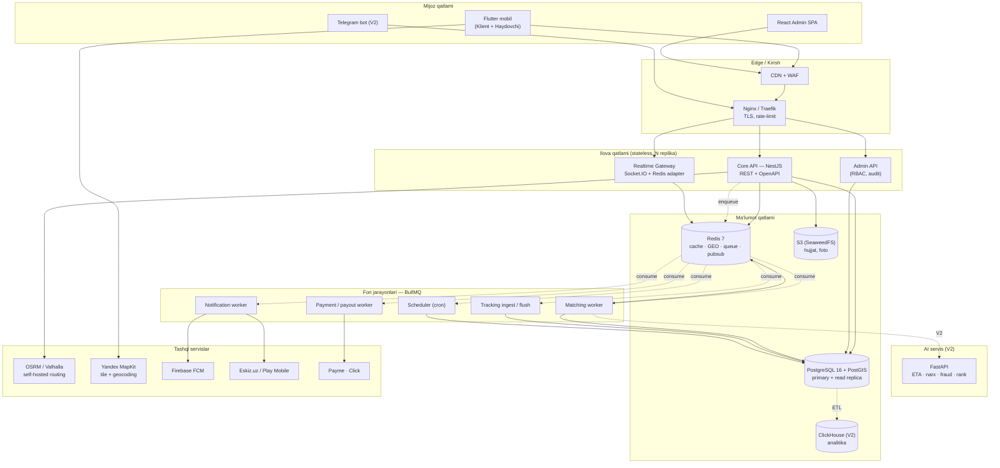
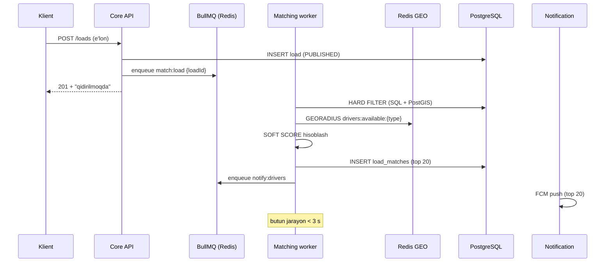

# 04 — Tizim arxitekturasi

## 4.1. Texnologiya tanlovi va uning asoslari

### Backend: NestJS (Node.js + TypeScript) — nega?

| Mezon | NestJS | Django | FastAPI |
|---|---|---|---|
| REST + WebSocket + Queue bitta framework'da | ✅ native | ⚠️ Channels alohida | ⚠️ qo'shimcha |
| Tiplar mobil/admin bilan umumiy (`packages/contracts`) | ✅ TS | ❌ | ❌ |
| Modular DI, katta jamoada tartib | ✅ eng kuchli | ⚠️ | ❌ zaif |
| I/O-bound yuk (chat, tracking, push) | ✅ event loop | ⚠️ | ✅ |
| ML/AI ekotizimi | ❌ | ✅ | ✅ |
| O'zbekistonda dasturchi topish | ✅ oson | ✅ | ⚠️ |

**Qaror:** Core platforma — **NestJS**. AI/ML (matching v2, ETA, fraud) —
alohida **Python FastAPI** servisi, gRPC/REST orqali chaqiriladi. Bu "har bir ish
uchun to'g'ri asbob" tamoyili; monolitni Python'ga o'tkazish shart emas.

### Nega mikroservis emas, **modular monolit**?

MVP bosqichida mikroservis = distributed transaction, service discovery, 10x
DevOps yuki, sekin release. Biz **modular monolit** quramiz: modul chegaralari
(`auth`, `loads`, `orders`, `matching`, `payments`, `tracking`, `chat`,
`notifications`) qat'iy, modullar bir-birini faqat servis interfeysi orqali
chaqiradi, umumiy DB sxemasi bo'lsa-da har bir modul faqat o'z jadvallariga
yozadi. Yuk oshganda `tracking`, `matching`, `chat` birinchi bo'lib alohida
servisga ajratiladi — kod tayyor bo'ladi.

---

## 4.2. Umumiy tizim arxitekturasi



### Nima uchun shunday

- **API stateless** — sessiya Redis'da, shuning uchun horizontal scale muammosiz.
- **WebSocket alohida deployment** — uzoq umrli ulanishlar API deploy'ida uzilmasin.
- **Worker'lar alohida** — matching yoki push sekinlashsa, API javob vaqti ta'sirlanmaydi.
- **Read replica** — admin analitikasi va og'ir hisobotlar primary'ni bo'g'masin.
- **OSRM self-hosted** — distance matrix chaqiruvi kuniga 100k+ bo'ladi; Google/Yandex
  API'da bu oyiga minglab dollar, OSRM'da esa bitta 4 GB VPS.

---

## 4.3. Autentifikatsiya arxitekturasi

```
POST /auth/otp/request  { phone }
   ├─ rate limit: 3/soat/raqam, 10/kun/IP, 1/60s
   ├─ code = 6 raqam (crypto random)
   ├─ Redis: otp:{phone} = {hash(code), attempts:0}  TTL 300s
   └─ SMS provayder (Eskiz) → queue

POST /auth/otp/verify   { phone, code, device }
   ├─ attempts++ ; > 5 bo'lsa 15 daqiqaga bloklash
   ├─ user topiladi yoki yaratiladi (status = PENDING_PROFILE)
   ├─ access_token  : JWT RS256, 15 daqiqa, payload {sub, role, ver}
   ├─ refresh_token : opaque 256-bit, DB'da SHA-256 hash, 30 kun
   └─ user_sessions ga yozuv: device_id, platform, ip, user_agent

POST /auth/refresh      { refresh_token }
   ├─ ROTATION: eski token darhol bekor qilinadi, yangisi beriladi
   └─ Reuse detection: bekor qilingan token qayta ishlatilsa →
      shu foydalanuvchining BARCHA sessiyalari o'chiriladi + xavfsizlik push
```

- `token_version` foydalanuvchi jadvalida — bloklash/rol o'zgarishida barcha
  access tokenlar bir zumda kuchsizlanadi.
- Rollar: `SHIPPER`, `DRIVER`, `BOTH`, `ADMIN`. Guard: `@Roles()` +
  `@ResourceOwner()` (o'z buyurtmasi bo'lmasa 403).
- Admin panel: alohida `admin_users` jadvali, Argon2id parol + majburiy TOTP 2FA.

---

## 4.4. Matching arxitekturasi



### 1-bosqich — HARD FILTER (SQL, PostGIS)

Bularsiz mos kelmaydi, ballga umuman kirmaydi:

```sql
WHERE d.status = 'ACTIVE'
  AND d.verification_status = 'VERIFIED'
  AND d.availability = 'AVAILABLE'
  AND v.capacity_kg      >= :cargo_weight_kg
  AND v.volume_m3        >= :cargo_volume_m3
  AND v.body_type_id      = ANY(:required_body_types)
  AND v.vehicle_type_id   = ANY(:required_vehicle_types)
  AND ST_DWithin(dl.geom::geography, :pickup_point::geography, :radius_m)
  AND NOT EXISTS (              -- shu vaqtda band emas
        SELECT 1 FROM orders o
        WHERE o.driver_id = d.id
          AND o.status IN ('CONFIRMED','EN_ROUTE_TO_PICKUP','ARRIVED_AT_PICKUP',
                           'LOADED','IN_TRANSIT','ARRIVED_AT_DELIVERY')
      )
  AND d.id <> ALL(:blacklist_driver_ids)
```

Radius bosqichma-bosqich kengayadi: **30 km → 80 km → 200 km**, har bosqichda
kamida 10 nomzod topilmasa keyingisiga o'tadi.

### 2-bosqich — SOFT SCORE (0…100)

```
MatchScore = 100 × (
    0.28 · proximity      +
    0.20 · route_fit      +
    0.14 · capacity_fit   +
    0.14 · rating         +
    0.10 · price_fit      +
    0.08 · reliability    +
    0.06 · history
)
```

| Komponent | Formula | Izoh |
|---|---|---|
| `proximity` | `max(0, 1 − d_km / R_km)` | Haydovchidan olish nuqtasigacha yo'l masofasi (OSRM), to'g'ri chiziq emas |
| `route_fit` | `1` — yuk yo'nalishi haydovchi e'lon qilgan yo'nalishga mos; `0.6` — teskari; `cos_sim` — burchak bo'yicha | Backhaul uchun asosiy |
| `capacity_fit` | `1 − |1 − cargo/capacity|`, `cargo > capacity` bo'lsa 0 | 20 t mashinaga 500 kg yuk — samarasiz, ball past |
| `rating` | `(avg_rating − 1) / 4`, < 5 ta baho bo'lsa `0.6` (neytral) | Yangi haydovchi jazolanmaydi (cold start) |
| `price_fit` | `1 − |offer − market| / market`, chegaralangan [0,1] | Bozor medianasi `route_price_stats` dan |
| `reliability` | `1 − cancel_rate_90d`, kech qolish jarimasi | Xulq-atvor |
| `history` | Shu klient bilan avval ishlagan bo'lsa `1`, sevimlida bo'lsa `1`, aks holda `0.5` | Takroriy hamkorlik |

**Nima uchun formula, ML emas?** Boshida ma'lumot yo'q (cold start). Formula
tushunarli, sozlanadi, admin panelidan og'irliklari o'zgartiriladi va
`match_weights_version` bilan versiyalanadi. Har bir match natijasi
(`shown → offered → accepted`) log qilinadi — bu 6-9 oydan keyin ML modelini
o'qitish uchun **tayyor training dataset** bo'ladi (LambdaMART / LightGBM ranker).

### Anti-spam / adolat qoidalari
- Bitta haydovchiga bir vaqtning o'zida **5 tadan ko'p faol taklif** yuborilmaydi.
- `MatchScore < 45` bo'lsa push yuborilmaydi (faqat lentada ko'rinadi).
- Har 3-o'rinda **yangi haydovchiga** ko'rsatiladi (exploration, 15%) — aks holda
  yuqori reytinglilar monopoliya qiladi va yangilar ketib qoladi.

---

## 4.5. GPS Tracking arxitekturasi

```
Flutter (background location)
   │  faol buyurtma: har 10 s YOKI 50 m siljish
   │  bo'sh/onlayn: har 120 s (batareya tejash)
   │  offline: SQLite buferga yoziladi, tarmoq qaytganda batch yuboriladi
   ▼
WebSocket  ws://…/tracking   event: "location:update"
   │  payload: {lat,lng,speed,heading,accuracy,ts,batteryLevel,orderId?}
   ▼
Realtime Gateway (NestJS)
   ├─ validatsiya: accuracy < 100 m, speed < 180 km/h, ts skew < 60 s
   ├─ Redis GEOADD drivers:available:{vehicle_type}   (bo'sh holatda)
   ├─ Redis SET driver:pos:{driverId} (TTL 5 daq)      ← "oxirgi joylashuv"
   ├─ Redis PUBLISH order:{orderId}:track              ← klient ko'radi
   └─ Redis LPUSH track:buffer                          ← batch yozuv
                                     ▼
                     Tracking flush worker (har 5 s)
                          COPY → driver_locations (partitioned by day)
```

### Muhim qarorlar

1. **GPS faqat faol buyurtmada yuqori chastotada.** Bu ham batareya, ham
   maxfiylik (foydalanuvchi ishonchi), ham xarajat masalasi. Bo'sh holatdagi
   haydovchi joylashuvi faqat matching uchun, past chastotada.
2. **Redis yozadi, Postgres emas.** 1000 faol haydovchi × 6 yozuv/daqiqa =
   360k yozuv/soat. To'g'ridan-to'g'ri INSERT — DB o'ladi. Batch `COPY` bilan
   5 soniyalik oynalarda yoziladi.
3. **Partitioning:** `driver_locations` kunlik partition, 90 kundan keyin
   partition `DETACH` + arxivga (S3 Parquet). Bu nizolar uchun dalil sifatida yetarli.
4. **ETA:** har 60 s da OSRM `/route` chaqiriladi (joriy nuqta → manzil), natija
   Redis'da 60 s cache. Trafik koeffitsienti (V2): shu yo'nalishdagi oxirgi
   30 kunlik real o'rtacha tezlik.
5. **Snap-to-road:** xom GPS nuqtalari OSRM `/match` (map matching) orqali
   yo'lga "yopishtiriladi" — xarita chizig'i chiroyli va masofa aniq bo'ladi.

---

## 4.6. Notification arxitekturasi

```
Hodisa (order.confirmed, offer.received, load.matched, payment.done, …)
   └─ EventEmitter → NotificationService.dispatch(event)
        ├─ Shablon tanlash: template_key + user.lang (uz/ru/en)
        ├─ Foydalanuvchi sozlamalari tekshiriladi (kanal on/off, "jim rejim")
        ├─ Idempotency: dedupe_key = hash(userId+event+entityId)  → 10 daq
        └─ Kanallar:
             ├─ IN_APP  : notifications jadvali + WS "notification:new"
             ├─ PUSH    : FCM (data + notification payload, deep link)
             ├─ SMS     : faqat kritik (OTP, buyurtma tasdiqlandi) — pul turadi
             └─ EMAIL   : korporativ mijoz (hisob-faktura, akt)
```

- **Deep link:** `karvon://order/{id}` — push bosilganda to'g'ri ekran ochiladi.
- **Prioritet:** `HIGH` (offer, status) → FCM `high_priority`, Android'da Doze rejimini yoradi.

### Ekran yuqorisidan sizib chiquvchi bildirishnoma (heads-up)

Chat xabari va buyurtma statusi **darhol ko'rinishi** kerak — foydalanuvchi
ilovani ochib qarashini kutib bo'lmaydi. Ikki holat bor va ikkalasi ham
hisobga olinadi:

**1. Ilova YOPIQ yoki fonda — tizim bildirishnomasi**

Android'da bildirishnoma ekran yuqorisidan "sizib chiqishi" (heads-up) uchun
kanal muhimligi `IMPORTANCE_HIGH` bo'lishi shart — bu ilova o'rnatilganda bir
marta yaratiladi va keyin o'zgarmaydi:

```
Kanal: karvon_messages   IMPORTANCE_HIGH   ovoz + vibratsiya   heads-up ✅
Kanal: karvon_orders     IMPORTANCE_HIGH   ovoz               heads-up ✅
Kanal: karvon_marketing  IMPORTANCE_LOW    ovozsiz            heads-up ❌
```

Serverdan FCM payload:

```jsonc
{
  "android": {
    "priority": "high",
    "notification": { "channel_id": "karvon_messages", "sound": "default" }
  },
  "apns": {
    "headers": { "apns-priority": "10", "apns-push-type": "alert" },
    "payload": { "aps": { "sound": "default", "interruption-level": "time-sensitive" } }
  },
  "data": { "type": "chat.message", "orderId": "…", "deepLink": "karvon://order/…/chat" }
}
```

iOS'da `interruption-level: time-sensitive` — "Focus" rejimi yoqilgan bo'lsa
ham bildirishnoma o'tadi (chat va buyurtma statusi uchun asoslangan).

**2. Ilova OCHIQ — in-app banner**

Ilova old planda bo'lsa tizim bildirishnomasi ko'rinmaydi. Shuning uchun xabar
**WebSocket orqali** ham keladi va Flutter ekranning yuqorisidan sirg'aluvchi
banner chiqaradi (`Overlay` + `SlideTransition`, 4 soniya, bosilsa chatga o'tadi,
yuqoriga surilsa yopiladi). Bu ikki kanal bir vaqtda kelsa — `dedupeKey`
bo'yicha bittasi ko'rsatiladi.

```
Xabar yuborildi
   ├─ WebSocket  → qabul qiluvchi ONLAYN bo'lsa   → in-app banner (darhol)
   └─ FCM push   → OFLAYN yoki fonda bo'lsa       → heads-up bildirishnoma
```

Server tomonda qaror: qabul qiluvchining `order:{id}` room'ida faol soketi
bormi. Bor bo'lsa — faqat WS, yo'q bo'lsa — push. Ikkalasi ham yuborilsa
foydalanuvchi bitta xabarni ikki marta ko'radi.
- **Retry:** FCM xatosi → exponential backoff (3 urinish). `UNREGISTERED` javobida
  device token o'chiriladi.
- **Jim rejim:** 23:00–07:00 oralig'ida faqat faol buyurtma bo'yicha pushlar o'tadi.

---

## 4.7. To'lov arxitekturasi (double-entry ledger)

Pul bilan ishlashda **yagona to'g'ri model — ikki yozuvli buxgalteriya**.
Har bir tranzaksiya kamida 2 ta `ledger_entries` yozuvini yaratadi va
`SUM(amount)` har doim `0` ga teng bo'lishi shart (invariant, test bilan tekshiriladi).

```
Hisob turlari (accounts):
  USER_WALLET      — har bir foydalanuvchining hamyoni
  ESCROW           — ushlab turilgan mablag' (V2)
  PLATFORM_REVENUE — komissiya daromadi
  PSP_CLEARING     — Payme/Click bilan hisob-kitob
  PAYOUT_PAYABLE   — haydovchiga to'lanishi kerak
```

**Misol: hamyonni to'ldirish 500 000 so'm (Payme)**
```
DEBIT   PSP_CLEARING        +50 000 000 tiyin
CREDIT  USER_WALLET(driver) −50 000 000 tiyin   → balans oshadi
```

**Misol: buyurtma yakunlandi, narx 2 000 000, komissiya 5%**
```
DEBIT   USER_WALLET(driver)  −10 000 000 tiyin   (100 000 so'm)
CREDIT  PLATFORM_REVENUE     +10 000 000 tiyin
```

### Muhim texnik qoidalar
- **Pul `bigint` tiyinda saqlanadi** (1 so'm = 100 tiyin). `float`/`double`
  hech qachon ishlatilmaydi — yaxlitlash xatosi moliyaviy nizoga olib keladi.
- **Idempotency key** har bir to'lov operatsiyasida majburiy — Payme/Click
  callback'ni 3 marta yuborishi normal holat.
- **Ledger yozuvlari o'zgarmas** (append-only). Xato bo'lsa — teskari yozuv
  (reversal), `UPDATE`/`DELETE` yo'q. DB darajasida trigger bilan bloklanadi.
- Payme `merchant API` (JSON-RPC: `CheckPerformTransaction`, `CreateTransaction`,
  `PerformTransaction`, `CancelTransaction`) va Click `Prepare/Complete` —
  ikkalasi ham alohida adapter sinflarida, umumiy `PaymentProvider` interfeysi ortida.

> **Huquqiy eslatma:** boshqa shaxslarning pulini ushlab turish (escrow)
> O'zbekistonda to'lov agenti / provayder maqomini yoki bank bilan shartnomani
> talab qiladi. Shuning uchun MVP'da **naqd + hamyon komissiyasi** modeli
> ishlatiladi, escrow esa bank hamkorligi rasmiylashtirilgach V2 da yoqiladi.

---

## 4.8. Chat arxitekturasi

- Socket.IO namespace `/chat`, room = `order:{orderId}`.
- Xabar oqimi: `client → WS → validate → INSERT messages → Redis PUBLISH →
  boshqa replikalar → qabul qiluvchiga emit`. Offline bo'lsa — FCM push.
- Fayl: mobil `POST /media/presign` → to'g'ridan-to'g'ri S3 ga yuklaydi →
  `attachment_key` bilan xabar yuboriladi. **Fayl API server orqali o'tmaydi.**
- Xavfsizlik: chat faqat `ASSIGNED`+ statusdagi buyurtma bo'yicha ochiladi;
  `CLOSED` dan keyin read-only.
- Saqlash: 1 yil, keyin arxiv.

### Kontakt ko'rinishi — asosiy biznes qoidasi

> **Haydovchi va yuk beruvchi bir-birining telefon raqamini faqat haydovchi
> yuk olish nuqtasiga yetib borgandan keyin ko'radi** (`ARRIVED_AT_PICKUP`).
> Unga qadar butun muloqot platforma ichidagi chat orqali ketadi.

| Bosqich | Chat | Olish kontakti | Yetkazish kontakti | Hamkor telefoni |
|---|---|---|---|---|
| `ASSIGNED` | ✅ ochiladi | maskalangan | maskalangan | maskalangan |
| `CONFIRMED` | ✅ | maskalangan | maskalangan | maskalangan |
| `EN_ROUTE_TO_PICKUP` | ✅ | maskalangan | maskalangan | maskalangan |
| **`ARRIVED_AT_PICKUP`** | ✅ | **✅ ochiq** | maskalangan | **✅ ochiq** |
| `LOADED` va keyin | ✅ | ✅ | **✅ ochiq** | ✅ |
| `CLOSED` | read-only | ✅ | ✅ | ✅ |
| `CANCELLED_*` | yopiq | ❌ | ❌ | ❌ |

**Nega shunday:** raqam erta ochilsa, tomonlar platformani chetlab o'tib
kelishib olishlari oson bo'ladi — komissiya ham, nizo himoyasi ham, tracking
ham yo'qoladi. Yetib borish payti esa bitim amalda boshlangan nuqta: bu yerda
chetlab o'tishning ma'nosi qolmaydi, aloqa esa haqiqatan zarur.

**Yetkazish nuqtasidagi kontakt** ko'pincha uchinchi shaxs (qabul qiluvchi)
bo'ladi va u yuk ortilgandan keyin ochiladi — haydovchi yo'lga chiqqach
kelishi haqida ogohlantirishi kerak.

**Favqulodda ochish.** Haydovchi manzilni topolmasligi yoki darvoza yopiq
bo'lishi mumkin. Shuning uchun raqam yopiq bo'lgan bosqichlarda ilovada
**"Bog'lana olmayapman"** tugmasi ko'rinadi (`emergencyRevealAvailable`).
U sabab so'raydi, raqamni ochadi va hodisani `audit_logs` ga yozadi.
Suiiste'mol qilinsa (bir haydovchi ko'p marta ishlatsa) — anti-fraud flag.

Bu qoidalar **bitta joyda** yashaydi: `modules/orders/order-status.ts` →
`contactVisibility(status)`. REST ham, WebSocket ham, mobil ilova ham
shundan foydalanadi — aks holda "ilovada raqam ko'rinadi, serverda yo'q"
kabi nomuvofiqlik muqarrar.

---

## 4.9. Deploy va muhitlar

| Muhit | Maqsad | Infra |
|---|---|---|
| `local` | Dasturchi | Docker Compose (pg+postgis, redis, seaweedfs, osrm, mailhog) |
| `dev` | Integratsiya | 1 VPS, auto-deploy `develop` branch |
| `staging` | QA, yuklama testi | prod nusxasi, anonimlashtirilgan ma'lumot |
| `prod` | Real | O'zbekistondagi DC, 2+ app node, PG primary+replica, kunlik backup |

CI/CD: GitHub Actions → lint → unit → e2e → Docker build → registry →
staging avtomatik → prod qo'lda tasdiq (manual approval).

**Backup:** PostgreSQL — `pg_basebackup` + WAL archiving (PITR), kunlik snapshot,
7 kunlik / 4 haftalik / 12 oylik retention. Tiklanish **har chorakda amaliy
tekshiriladi** (backup tiklanmasa, u backup emas).

**SLO maqsadlari:** API p95 < 300 ms · WS xabar yetkazish p95 < 500 ms ·
matching < 3 s · uptime 99.5% (MVP) → 99.9% (V2).
