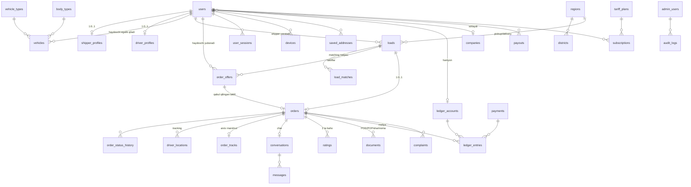

# 05 — Ma'lumotlar bazasi arxitekturasi

To'liq DDL: [`db/migrations/0001_init.sql`](../db/migrations/0001_init.sql) — 40 ta jadval, PostgreSQL 16 + PostGIS.

## 5.1. ER diagram (asosiy o'zak)



## 5.2. Jadvallar ro'yxati (40 ta)

| Guruh | Jadvallar |
|---|---|
| **Spravochnik** | `regions`, `districts`, `vehicle_types`, `body_types`, `cargo_categories`, `special_requirements` |
| **Auth** | `users`, `otp_requests`, `user_sessions`, `devices`, `login_history` |
| **Profil** | `companies`, `shipper_profiles`, `driver_profiles` |
| **Transport** | `vehicles`, `driver_routes` |
| **Manzil** | `saved_addresses` |
| **Yuk** | `loads` |
| **Matching** | `load_matches`, `return_load_intents`, `route_price_stats` |
| **Buyurtma** | `order_offers`, `orders`, `order_status_history` |
| **Tracking** | `driver_locations` (partitioned), `order_tracks` |
| **Chat** | `conversations`, `messages` |
| **Bildirishnoma** | `notifications`, `notification_settings` |
| **Moliya** | `ledger_accounts`, `ledger_entries`, `payments`, `payouts`, `tariff_plans`, `subscriptions` |
| **Ishonch** | `ratings`, `complaints`, `favorites`, `blacklists` |
| **Hujjat** | `documents` |
| **Admin** | `admin_users`, `admin_roles`, `audit_logs`, `platform_settings` |

## 5.3. Muhim dizayn qarorlari va ularning sababi

### 1. `loads` va `orders` — alohida jadvallar
E'lon (`load`) va bitim (`order`) — turli hayotiy sikl va turli xil ma'lumot.
E'lon bekor bo'lishi, muddati o'tishi mumkin; buyurtma esa moliyaviy hujjat.
Ularni birlashtirsak, `orders` jadvalining yarmi NULL bo'lardi va moliyaviy
hisobot murakkablashardi. `orders.load_id` — `UNIQUE` (1 yuk → maksimum 1 buyurtma).

### 2. Pul — `BIGINT` tiyinda
`NUMERIC` sekinroq va `FLOAT` yaxlitlash xatosini beradi
(`0.1 + 0.2 ≠ 0.3`). Barcha summalar butun sonda: `2 000 000 so'm = 200 000 000 tiyin`.
`bigint` chegarasi ≈ 9.2×10¹⁸ — yetarlidan ortiq.
Ko'rsatishda mobil/admin `Intl.NumberFormat('uz-UZ')` bilan formatlaydi.

### 3. `orders` da narx va komissiya "muzlatiladi"
`commission_rate` buyurtma yaratilgan paytdagi qiymat bilan saqlanadi. Admin
ertaga komissiyani 5% dan 7% ga oshirsa, eski buyurtmalar o'zgarmaydi.
`CHECK` constraint arifmetikani DB darajasida kafolatlaydi:
`driver_payout = price − commission`.

### 4. Denormalizatsiya — ongli ravishda
`users.rating_avg`, `users.completed_orders`, `ledger_accounts.balance_tiyin`
hisoblangan qiymatlar. Har safar `AVG()` yoki `SUM()` qilish — profil ochilishida
sekinlik. Ular tranzaksiya ichida yangilanadi va **kunlik reconciliation job**
haqiqiy yig'indi bilan solishtiradi (nomuvofiqlik topilsa — alert).

### 5. `driver_locations` — RANGE partitioning
Eng tez o'sadigan jadval (kuniga ~10 mln qator 1000 faol haydovchida).
Oylik partition; 90 kundan keyin `DETACH PARTITION` + S3 ga Parquet arxiv +
`DROP`. `DELETE FROM ... WHERE recorded_at < ...` bilan taqqoslaganda partition
o'chirish **millisekundlarda** bajariladi va `VACUUM` yuki yo'q.

### 6. Geo maydonlar — `geography(Point,4326)`, `geometry` emas
`geography` sferik hisob qiladi — `ST_DWithin(a, b, 30000)` to'g'ridan-to'g'ri
metrda ishlaydi, proyeksiya bilan ovora bo'lish shart emas. GIST indeks
radius qidiruvni tez qiladi. Aniq marshrut masofasi esa OSRM'dan olinadi
(to'g'ri chiziq emas, real yo'l).

### 7. Partial (shartli) indekslar
```sql
CREATE INDEX idx_loads_status_pub ON loads(status, published_at DESC)
    WHERE status IN ('PUBLISHED','MATCHING','OFFERS_RECEIVED');
```
Faol yuklar — jadvalning ~2%. Shartli indeks 50 barobar kichik, RAM'da qoladi,
`INSERT` sekinlashmaydi. Xuddi shu tamoyil `uq_driver_active_order` da:
**bitta haydovchida bir vaqtda bitta faol buyurtma** — bu biznes qoidasi
ilova kodida emas, **DB darajasida** kafolatlanadi (race condition bo'lmaydi).

### 8. Ledger — append-only + balanced invariant
`ledger_entries` da `UPDATE`/`DELETE` trigger bilan **taqiqlangan**. Har bir
`transaction_id` bo'yicha `SUM(amount_tiyin) = 0` — `DEFERRABLE` constraint
trigger tranzaksiya oxirida tekshiradi. Bu moliyaviy ma'lumot buzilishining
oldini oladigan eng kuchli himoya: xato kod ham balansni buza olmaydi.

### 9. Massiv maydonlar + GIN indeks
`loads.required_vehicle_type_ids SMALLINT[]` — bitta yukka bir nechta transport
turi mos kelishi mumkin. Alohida `load_vehicle_types` jadvali JOIN talab qiladi;
massiv + GIN indeks `&&` (kesishish) operatori bilan tezroq va soddaroq.
Bu maydonlar **faqat filter uchun**, hisobot uchun emas — shuning uchun
normalizatsiya buzilishi oqlanadi.

### 10. Shaxsiy ma'lumotlar shifrlanadi
`passport_number_enc`, `pinfl_enc`, `license_number_enc`, `totp_secret_enc` —
`BYTEA`, ilova darajasida **AES-256-GCM** bilan shifrlanadi (kalit KMS/env'da,
DB'da emas). DB dump o'g'irlansa ham pasport raqamlari o'qilmaydi.
Qidiruv kerak bo'lsa — alohida `blind index` (HMAC) ustuni qo'shiladi.

### 11. Soft delete — faqat kerakli joyda
`users`, `vehicles`, `loads`, `documents`, `messages` da `deleted_at`.
`orders` va `ledger_entries` da **hech qachon** — moliyaviy hujjat o'chirilmaydi.
Foydalanuvchi "akkauntni o'chirish" so'rasa: shaxsiy maydonlar anonimlashtiriladi
(`first_name = 'O''chirilgan'`, `phone = 'deleted_<id>'`), buyurtma tarixi
statistik shaklda qoladi.

## 5.4. Asosiy so'rovlar va ularning indekslari

| So'rov | Indeks | Kutilgan vaqt |
|---|---|---|
| Haydovchi lentasi (faol yuklar, filter bilan) | `idx_loads_status_pub` + `idx_loads_route` | < 30 ms |
| Radiusdagi bo'sh haydovchilar | Redis GEO (asosiy) + `idx_driver_geom` (fallback) | < 10 ms |
| Buyurtma tarixi (foydalanuvchi) | `idx_orders_driver_status` / `idx_orders_shipper_status` | < 20 ms |
| Chat xabarlari (sahifalash) | `idx_messages_conv` | < 15 ms |
| Hamyon balansi va tarixi | `idx_entries_account` | < 20 ms |
| Admin: verifikatsiya navbati | `idx_docs_verify` (partial) | < 20 ms |
| Tracking: buyurtma marshruti | `idx_dl_order_time` + partition pruning | < 50 ms |

## 5.5. Migratsiya strategiyasi va DB qatlami

> **2-bosqichda aniqlashtirilgan qaror.** 1-bosqichda "Prisma Migrate yoki
> TypeORM" deb qoldirilgan edi. Kodga o'tganda tanlov yakunlandi:
> **SQL-first migratsiya + Kysely query builder**. Sabab quyida.

| Variant | Nima uchun tanlanmadi |
|---|---|
| Prisma | PostGIS tiplarini `Unsupported` deb belgilaydi va ular bilan ishlab bo'lmaydi; partitioning va `DEFERRABLE` triggerlarni generatsiya qilmaydi. Natijada "generatsiya qilingan, keyin qo'lda tuzatilgan" migratsiya paydo bo'ladi — eng yomon holat |
| TypeORM | Migratsiyalari ishonchsiz, geo bilan ishlash noqulay, ekotizim sekinlashgan |
| **Kysely** ⭐ | Query builder, ORM emas: to'liq tip xavfsizligi + SQL ustidan to'liq nazorat. Kodgeneratsiya bosqichi yo'q. Generatsiya qilingan SQL o'qiladigan va `EXPLAIN ANALYZE` bilan optimallashtiriladigan bo'ladi |

**Amalda:**
- `db/migrations/NNNN_*.sql` — versiyalangan SQL fayllar, **yagona haqiqat manbai**.
- `apps/api/src/infra/database/migrator.ts` — ularni tartib bilan qo'llaydi va
  `schema_migrations` jadvalida checksum bilan qayd etadi.
- **Qo'llangan migratsiyani tahrirlash mumkin emas** — checksum mos kelmasa
  migrator xato beradi. Tuzatish uchun yangi fayl yoziladi.
- `apps/api/src/infra/database/database.types.ts` — SQL'ning TS aksi;
  har bir modul o'z jadvallarini qo'shib boradi.
- Geo so'rovlar (`ST_DWithin`, `ST_MakePoint`) Kysely'ning `sql` shabloni
  orqali — parametrlangan va SQL injection'dan himoyalangan.

**Zero-downtime qoidalari (o'zgarishsiz):**
- Ustun o'chirish va nom o'zgartirish ikki bosqichda (avval kod ikkalasini ham
  qo'llab-quvvatlaydi, keyin eski ustun o'chiriladi).
- Har bir migratsiya staging'da prod hajmidagi ma'lumotda sinaladi.
- `CREATE INDEX CONCURRENTLY` — prodda jadval bloklanmasligi uchun (bunday
  migratsiya tranzaksiyadan tashqarida, alohida faylda bajariladi).

## 5.6. Seed ma'lumotlar (`db/seeds/`)

1. **14 hudud** — nomlari 3 tilda, markaziy nuqta koordinatalari, chegara polygonlari.
2. **~200 tuman** — viloyatlar bo'yicha.
3. **Transport turlari:** Damas (0.5 t), Labo (1 t), Gazel (1.5 t), Isuzu (3–5 t),
   MAN/KamAZ (10–20 t), Fura/Tirkama (20–25 t), Volvo/Scania (20–25 t).
4. **Kuzov turlari:** Tent, Refrijerator, Izoterm, Ochiq bort, Furgon, Samosval,
   Platforma, Sisterna, Konteynervoz.
5. **Yuk kategoriyalari:** Oziq-ovqat, Qurilish materiallari, Mebel, Maishiy texnika,
   Kiyim-kechak, Qishloq xo'jaligi mahsulotlari, Metall, Sanoat uskunalari,
   Ko'chish (uy yuki), Boshqa.
6. **Maxsus talablar:** Gruzchik, Gidrobort, Ramp, Temperatura rejimi, Plomba, GPS-nazorat.
7. **Tarif rejalari:** FREE, DRIVER_PREMIUM, SHIPPER_PREMIUM, CORP_BASIC, CORP_PRO.
8. **Admin rollar:** SUPER_ADMIN, MODERATOR, SUPPORT, FINANCE, ANALYST.
